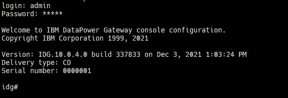

<!-- eZetsu: Edilson Mucanze -->
<!-- email: macauleonardo@gmail.com -->
<!-- DevOps Automation Path -->

# IBM DATAPOWER GATEWAY (Docker)

## Getting Started

**Prerequisites**:

- Docker (any version)

### Development Environment

This project has 2 docker compose files, which one include pre configuration with basic setup for use (include active mgmt and ssh) and the second requires your setup after sping the container.

### Get your DataPower engine started

1. Create a directory called **datapower** to host the project files
2. Enter into the created directory and clone this project or you can pull the image yourself with these commands:
   1. - docker pull icr.io/cpopen/datapower/datapower-limited:10.0.1.5 or
   2. - docker pull icr.io/cpopen/datapower/datapower-limited:10.0.4.0
   3. - docker pull cp.icr.io/cp/datapower/datapower-nonprod

3. After the download completes, the DataPower image should appear in your registry

 ```code
    REPOSITORY                                          TAG                         IMAGE ID       CREATED         SIZE
    icr.io/cpopen/datapower/datapower-limited           10.0.4.0                    4c511991491e   2 years ago     1.87GB
    icr.io/cpopen/datapower/datapower-limited           10.0.1.5                    07c90bfbadcc   2 years ago     1.7GB
```

On the first time we start the container it's import to run it on a detached mode to access the datapower cli for intial setup in case you use the non-prod compose file. Once it's stared we have few steps to go.

4. Start the container for the first time with the command below

```code
 docker run -it \
   -v ./lab-pre-setup/container_data/configs:/opt/ibm/datapower/drouter/config \
   -v ./lab-pre-setup/container_data/local:/opt/ibm/datapower/drouter/local \
   -v ./lab-pre-setup/container_data/certs:/opt/ibm/datapower/root/secure/usrcerts \
   -e DATAPOWER_ACCEPT_LICENSE=true \
   -e DATAPOWER_INTERACTIVE=true \
   -p 9090:9090 \
   -p 9022:22 \
   -p 5554:5554 \
   -p 8000-8010:8000-8010 \
   --name idg \
   ibmcom/datapower
 ```

4.1. Login to the CLI to complete the initial setup
- Default Login credentials:
  - user: **admin**
  - password: **admin**



Initial Setup steps

```bash
 idg# config
 Global mode
 idg(config)# web-mgmt
 Modify Web Management Service configuration
 idg(config web-mgmt)# admin-state enabled
 idg(config web-mgmt)# exit
 idg(config)# ssh 0.0.0.0 22
 idg(config)# write mem
 Overwrite previously saved configuration? Yes/No [y/n]: y
 idg(config)# exit
 idg# exit
```

<!-- Stop the container -->
Once the initial setup is done, validate if you can access the MGMT port by accessing ```https://localhost:9090/``` and admin:admin as your username and password to authenticate. If you can access it, you can stop the container and start it on detached mode since all the configuration are now saved on the mapped volumes path.

**OR JUST START THE CONTAINER USING:**
``docker compose -f docker-compose-noprod.yaml up -d``

#### Notes:

This is require less configuration since the initial setup is pre-config and also ssh access to get to the CLI. I have changed the initial user to ensure that ssh is working properly on the docker since it requires the container to run as root (for prod this requires discussion), mean while i'm looking for a way to have it running ssh rootless.

**SSH into gateway for CLI**
```ssh -oHostKeyAlgorithms=+ssh-rsa 172.0.0.1 -p 9022```

In case of an issue when changing configs on container
```Delete host:  ssh-keygen -f "/home/ezetsu/.ssh/known_hosts" -R "[localhost]:9022"```
